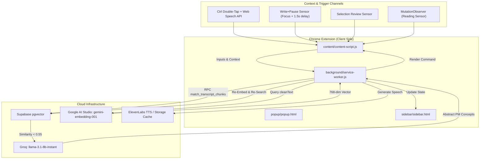

# 🎙️ Lenny Live — Your Ambient PM Mentor (Chrome Extension)

> **Compounded experience. Borrowed intuition. Surfaced in your workflow.**
> 
> *A Chrome extension that surfaces the wisdom of 300+ product leaders directly into your workspace — Notion, Jira, Linear, Google Docs — exactly when your brain is inside the problem.*

---

## 🌟 Overview & Product Vision

Early-stage Product Managers (PMs/APMs) face a steep learning curve. While Lenny Rachitsky's podcast and newsletter contain a goldmine of insights from 300+ world-class product leaders, navigating this archive is overwhelming. Furthermore, when PMs are writing a PRD, drafting user stories, or mapping out GTM plans, they rarely switch tabs to search for resources.

**Lenny Live** solves this by pushing contextual guidance directly into the PM's active window. It uses **ambient semantic detection**, **low-latency Retrieval-Augmented Generation (RAG)**, and a **dual-channel response system** (ElevenLabs voice clone + a visual Postcard) to act as a real-time mentor.

---

## 🏗️ System Architecture



---

## 🚀 Key Features & Interactive Modes

### 1. Active Mode: Speech-to-Text Querying (Double-Tap `Ctrl`)
- **Action:** Double-tap `Ctrl` on any page to activate Lenny. An audio cue plays, and Lenny listens via the built-in **Web Speech API**.
- **Execution:** Speak your prompt naturally (e.g., *"What is the best way to run user interviews?"*). Tap `Ctrl` again or stop speaking to trigger the low-latency RAG pipeline.

### 2. Passive Mode: Ambient PM Concept Detection
- **Write+Pause Sensor:** Watches focused input areas (Notion blocks, Google Docs, Jira fields). If the user writes $\ge 40$ words and pauses for 1.5 seconds, the text is evaluated. If a PM concept is identified, a bottom-right badge glows: `"Lenny has thoughts →"`.
- **Selection Review:** Highlight any text (up to 2,000 characters) and double-tap `Ctrl` to ask *"What do you think?"*. Lenny reads the selected text, embeds it as context, and provides a structured review (1 strength, 1 improvement, 1 critical question).
- **Reading Sensor:** Uses a `MutationObserver` to watch visible text on supported PM platforms, scanning for concepts using a high-precision regular expression (`PM_ROOTS`).

### 3. Dual-Channel Response Delivery
- **Audio Channel:** Lenny's cloned voice (powered by ElevenLabs) delivers a concise, conversational 30-40 second insight.
- **Visual Channel ("The Postcard"):** Slips in from the bottom-right corner, showcasing a short summary, a pull quote from the episode transcripts, guest credentials, and links to the source YouTube video. It includes options to **Replay**, **Save** to your library, or **Dismiss**.

---

## 🛠️ Deep Technical Details & Design Decisions

### 1. Dual-Gate Input Filter (Regex + Groq Classification)
To prevent accidental triggers, the pipeline implements a two-stage filter:
- **Gate 1 (Local Regex Guard):** Filters out immediate small talk, greetings, or meta-instructions without consuming API credits.
- **Gate 2 (Groq Classification):** Offloads complex queries to `llama-3.1-8b-instant` on Groq (processing in $<200\text{ms}$). Queries lacking business/PM nouns (e.g., *"I'm hungry"* or *"xkcd agile meme"*) return `NOT_PM` and trigger a silent fallback toast rather than executing expensive database searches.

### 2. Three-Tier Confidence Band & Abstraction Fallback
We calibrated `gemini-embedding-001` (768 dimensions), which yields a peak similarity of $\sim 0.62$ for highly aligned text:
- **$\ge 0.55$ (High Confidence):** Fast path. Directly fetch and serve the matching transcript chunk.
- **$0.45$ to $0.54$ (Low Confidence):** Fall through to Groq. 
- **$< 0.45$ (No Match - Niche Domains):** If a user asks about a domain not present in the transcripts (e.g., *"claim settlement in insurance"*), Groq abstracts this niche terms to underlying PM concepts (e.g., *"dispute resolution, customer experience"*). We re-embed these concepts and perform a second search with a lower threshold ($0.35$). This guarantees a structured, relevant PM response.

### 3. SPA-Safe pageContext Cascade
In SPAs like Notion, Linear, or Google Docs, `document.body.innerText` is polluted with navigation panels and sidebars. To solve this, Lenny Live implements a prioritization cascade:
1. **Active cursor block** (`document.activeElement` check for active inputs/textareas).
2. **Semantic main container** (`document.querySelector('article, main, [role="main"]')`).
3. **Document title** (last resort).

---

## 📊 Database Schema (Supabase pgvector)

### Curated Transcript Chunks (`transcript_chunks`)
Tracks core podcast insights, episode references, and pre-computed embeddings.
```sql
create table if not exists transcript_chunks (
  id              uuid primary key default gen_random_uuid(),
  topic           text not null,          -- display label
  guest_name      text not null,
  insight         text not null,          -- one-line TTS summary (≤120 chars)
  pull_quote      text not null,          -- detailed transcript text (≤550 chars)
  episode_title   text not null,
  youtube_url     text not null,
  timestamp_secs  integer not null,
  audio_url       text,                   -- pre-generated storage URL
  embedding       vector(768),            -- gemini-embedding-001 (768 dims)
  created_at      timestamptz not null default now()
);
```

### RAG Match Function (RPC)
Calculates cosine similarity on the vector index to surface matches.
```sql
create or replace function match_transcript_chunks(
  query_embedding  vector(768),
  match_threshold  float   default 0.5,
  match_count      int     default 3
)
returns table (
  id             uuid,
  topic          text,
  guest_name     text,
  insight        text,
  pull_quote     text,
  episode_title  text,
  youtube_url    text,
  timestamp_secs integer,
  audio_url      text,
  similarity     float
)
language sql stable as $$
  select
    id, topic, guest_name, insight, pull_quote,
    episode_title, youtube_url, timestamp_secs, audio_url,
    1 - (embedding <=> query_embedding) as similarity
  from transcript_chunks
  where 1 - (embedding <=> query_embedding) > match_threshold
  order by embedding <=> query_embedding
  limit match_count;
$$;
```

---

## 📂 Project Structure & Key Code References

- [manifest.json](file:///Users/rajat/AntiGravity/LennyLive/manifest.json) — Defines Manifest V3 extension permissions, background scripts, and side-panel targets.
- [background/service-worker.js](file:///Users/rajat/AntiGravity/LennyLive/background/service-worker.js) — The central service worker driving RAG coordination, caching, and state.
- [background/rag.js](file:///Users/rajat/AntiGravity/LennyLive/background/rag.js) — Houses Google Gemini query embedding and Supabase vector client queries.
- [background/abstraction.js](file:///Users/rajat/AntiGravity/LennyLive/background/abstraction.js) — Integrates Groq LLM to handle niche category mappings and input classifications.
- [content/content-script.js](file:///Users/rajat/AntiGravity/LennyLive/content/content-script.js) — Manages keyboard hotkeys, shadow DOM visual Postcard widgets, and text sensors.
- [supabase/migrations/](file:///Users/rajat/AntiGravity/LennyLive/supabase/migrations/) — Database schemas, indices, functions, and streak tracking rules.

---

## 💻 Local Setup & Installation

### 1. Load the Chrome Extension
1. Open Google Chrome and navigate to `chrome://extensions/`.
2. Enable **Developer mode** (toggle in the top-right).
3. Click **Load unpacked** and select the root `LennyLive/` project directory.

### 2. Configure Credentials
Because Chrome extensions cannot access local environment files directly, API configurations are defined in `background/config.js` (which is excluded from Git tracking for security):
Create `background/config.js` inside the workspace and define:
```javascript
const CONFIG = {
  SUPABASE_URL: "https://your-supabase-url.supabase.co",
  SUPABASE_ANON_KEY: "your-supabase-anon-key",
  GOOGLE_AI_API_KEY: "your-gemini-ai-studio-key",
  GROQ_API_KEY: "your-groq-key",
  ELEVENLABS_AGENT_ID: "your-elevenlabs-agent-id",
  ELEVENLABS_VOICE_ID: "your-elevenlabs-voice-id"
};
```

---

## 🏆 Project Context
*This project was developed for the Lenny Rachitsky Data Challenge (April 2026).*
